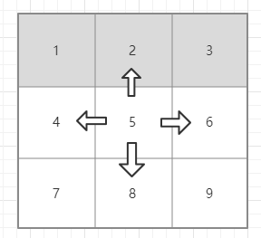

# 分支定界法

分支定界法（branch and bound）是一种求解整数规划问题的最常用算法。这种方法不但可以求解纯整数规划，还可以求解混合整数规划问题。分支定界法是一种搜索与迭代的方法，选择不同的分支变量和子问题进行分支。

通常，把全部可行解空间反复地分割为越来越小的子集，称为分支；并且对每个子集内的解集计算一个目标下界（对于最小值问题），这称为定界。在每次分枝后，凡是界限超出已知可行解集目标值的那些子集不再进一步分枝，这样，许多子集可不予考虑，这称剪枝。这就是分枝定界法的主要思路。

***[百度百科](https://baike.baidu.com/item/%E5%88%86%E6%94%AF%E5%AE%9A%E7%95%8C%E6%B3%95)***

## 问题示例

最近在群里看到一个问题：

给定m * n矩阵matrix，可以从任意位置开始，向上、向下、向左、向右移动，但要求下一个位置上的元素要大于当前元素。找出最长的递增路径长度。

如图，矩阵元素`5`的上下左右分别是`2`,`8`,`4`,`6`



根据某算法大佬的指导，使用分支定界法解决此问题。

将矩阵的每一个元素作为第一级分支A，对于每一个分支A相邻的上下左右四个元素，作为分支A的子分支B

选定一个元素An, 对比An与AnBm的大小，当An小于AnBm时，找到AnBm对于的元素Ax，递归循环处理，直至找不到AnBm。每递归一次，路径长度+1，最后返回最大的路径长度。

### 代码示例

[代码文件](bnb.cpp)(*这是一份快速实现的代码，所以不一定是最优。*)

```cpp
#include <iostream>
#include <vector>
using namespace std;

vector<vector<int>> randMatrix(int x, int y)
{
    vector<vector<int>> matrix(x);
    for (int i = 0; i < x; i++)
    {
        matrix[i].resize(y);
        for (int j = 0; j < y; j++)
        {
            matrix[i][j] = rand() % 100;
        }
    }
    return matrix;
}

void display(vector<vector<int>> matrix, int x, int y)
{
    for (int i = 0; i < x; i++)
    {
        for (int j = 0; j < y; j++)
        {
            cout << matrix[i][j] << " ";
        }
        cout << endl;
    }
    cout << endl;
}

vector<int> up(vector<vector<int>> matrix, int x, int y)
{
    auto res = vector<int>(3) = {-1, -1, -1};
    if (x == 0)
    {
        return res;
    }
    res[0] = matrix[x - 1][y];
    res[1] = x - 1;
    res[2] = y;
    return res;
}

vector<int> down(vector<vector<int>> matrix, int x, int y)
{
    auto res = vector<int>(3) = {-1, -1, -1};

    auto xlen = matrix.size();
    if (x == xlen - 1)
    {
        return res;
    }
    res[0] = matrix[x + 1][y];
    res[1] = x + 1;
    res[2] = y;
    return res;
}

vector<int> left(vector<vector<int>> matrix, int x, int y)
{
    auto res = vector<int>(3) = {-1, -1, -1};

    if (y == 0)
    {
        return res;
    }
    res[0] = matrix[x][y - 1];
    res[1] = x;
    res[2] = y - 1;
    return res;
}

vector<int> right(vector<vector<int>> matrix, int x, int y)
{
    auto res = vector<int>(3) = {-1, -1, -1};

    auto row = matrix[x];
    auto ylen = row.size();
    if (y == ylen - 1)
    {
        return res;
    }
    res[0] = matrix[x][y + 1];
    res[1] = x;
    res[2] = y + 1;
    return res;
}

vector<vector<vector<int>>> branch(vector<vector<int>> matrix, int x, int y)
{
    auto branch = vector<vector<vector<int>>>(x * y);
    auto index = 0;
    for (int i = 0; i < x; i++)
    {
        for (int j = 0; j < y; j++)
        {
            branch[index].resize(7);
            branch[index][0].resize(1);
            branch[index][0][0] = matrix[i][j];
            branch[index][1].resize(1);

            branch[index][1][0] = i;
            branch[index][2].resize(1);

            branch[index][2][0] = j;

            branch[index][3] = up(matrix, i, j);

            branch[index][4] = down(matrix, i, j);
            branch[index][5] = left(matrix, i, j);
            branch[index][6] = right(matrix, i, j);
            index++;
        }
    }
    return branch;
}

int finditem(vector<vector<vector<int>>> branches, int tx, int ty, int plen = 0)
{
    int ulen, dlen, llen, rlen;
    ulen = dlen = llen = rlen = plen;
    for (auto vi : branches)
    {
        if (vi[1][0] == tx && vi[2][0] == ty)
        { //找到元素
            if (vi[3][0] > vi[0][0])
            { //上
                cout << "up [" << vi[3][0] << "] is great than me [" << vi[0][0] << "]" << endl;
                ulen++;
                ulen = finditem(branches, vi[3][1], vi[3][2], ulen);
            }
            if (vi[4][0] > vi[0][0])
            { //下
                cout << "down [" << vi[4][0] << "] is great than me [" << vi[0][0] << "]" << endl;
                dlen++;
                dlen = finditem(branches, vi[4][1], vi[4][2], dlen);
            }
            if (vi[5][0] > vi[0][0])
            { //左
                cout << "left [" << vi[5][0] << "] is great than me [" << vi[0][0] << "]" << endl;
                llen++;
                llen = finditem(branches, vi[5][1], vi[5][2], llen);
            }
            if (vi[6][0] > vi[0][0])
            { //右
                cout << "right [" << vi[6][0] << "] is great than me [" << vi[0][0] << "]" << endl;
                rlen++;
                rlen = finditem(branches, vi[6][1], vi[6][2], rlen);
            }
        }
    }
    plen = ulen;
    if (plen < dlen)
    {
        plen = dlen;
    }
    if (plen < llen)
    {
        plen = llen;
    }
    if (plen < rlen)
    {
        plen = rlen;
    }
    return plen;
}

int main()
{
    const int x = 4;
    const int y = 4;
    auto matrix = randMatrix(x, y);
    display(matrix, x, y);
    auto branches = branch(matrix, x, y);
    // display(branches, x * y, 7);
    auto plen = finditem(branches, 0, 3);
    cout << matrix[1][2] << "\t" << plen << endl;
    return 0;
}
```